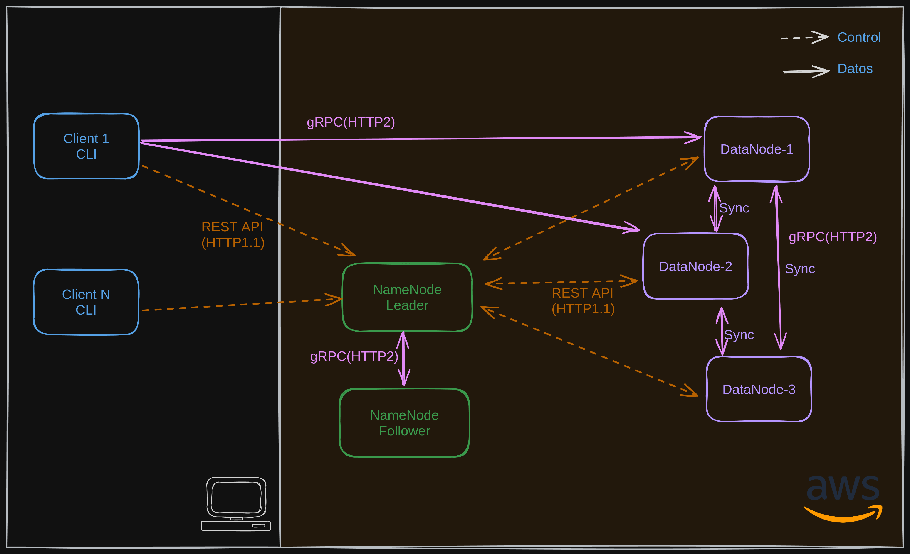
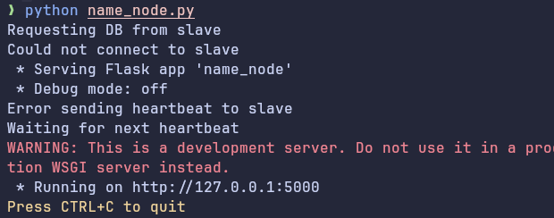
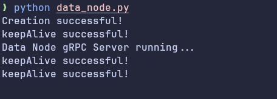
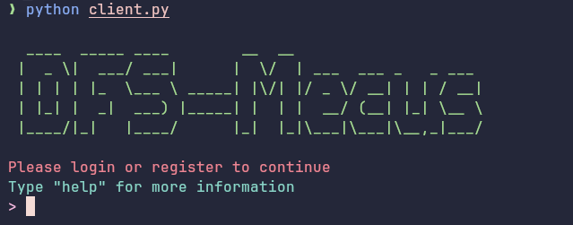

# PROJECT 1: Distributed File System
```
  ____  _____ ____        __  __
 |  _ \|  ___/ ___|      |  \/  | ___  ___ _   _ ___ 
 | | | | |_  \___ \ _____| |\/| |/ _ \/ __| | | / __|
 | |_| |  _|  ___) |_____| |  | |  __/ (__| |_| \__ \
 |____/|_|   |____/      |_|  |_|\___|\___|\__,_|___/

```
Distributed file system (DFS) centerd on chunk-based storage.
The architecture involves chunk-level distribution, data replication,
and fault tolerance. This system adopts a WORM (write-once, read-many)
paradigm, which means that once a file is uploaded, it cannot be modified.

## Base architecture 



**The architecture is composed of three main components: the client, the data node, and the name node.**

> The client is responsible for sending requests to the name node,
> which is responsible for managing the metadata of the files and the data nodes.
> The data nodes are responsible for storing the chunks of the files.

## Running the project in a local environment:

### 1. Cloning the repository
First, clone the repository to your local machine using the following command:
```bash
$ git clone https://github.com/Adrephos/DFS-Mecus
$ cd DFS-Mecus
```

### 2. Running the name node
To run the name node, execute the following commands:
```bash
# Change to the name node directory
$ cd name-node
# Create a virtual environment
$ python -m venv venv
# Activate the virtual environment
$ source venv/bin/activate
# Install the dependencies
$ pip install -r requirements.txt
# Run the name node
$ python name_node.py
```
The name node can be configured by modifying the `bootstrap.py` file.



> [!TIP]
> If you want to run a secondary name node, you can do so by running it with the commented configuration in the `bootstrap.py` file.

### 3. Running the data node
To run the data node, execute the following commands:
```bash
# Change to the data node directory
$ cd data-node
# Create a virtual environment
$ python -m venv venv
# Activate the virtual environment
$ source venv/bin/activate
# Install the dependencies
$ pip install -r requirements.txt
# Run the data node
$ python data_node.py
```
The data node can be configured by modifying the `bootstrap.py` file.



### 4. Running the client
To run the client, execute the following commands:
```bash
# Change to the client directory
$ cd client
# Create a virtual environment
$ python -m venv venv
# Activate the virtual environment
$ source venv/bin/activate
# Install the dependencies
$ pip install -r requirements.txt
# Run the client
$ python client.py
```
The client can be configured by modifying the `bootstrap.py` file.



## References
- [The Google File System](https://g.co/kgs/XzwmU76)
- [Hadoop File System](https://es.wikipedia.org/wiki/Hadoop_Distributed_File_System)
- [gRPC](https://grpc.io/docs)
- [Distributed file system](https://en.wikipedia.org/wiki/Distributed_data_store)
